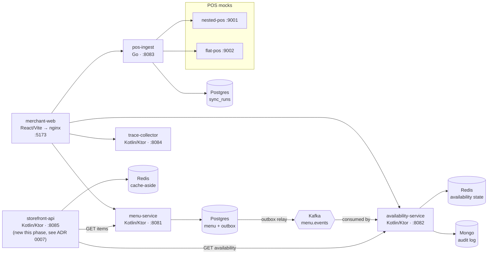
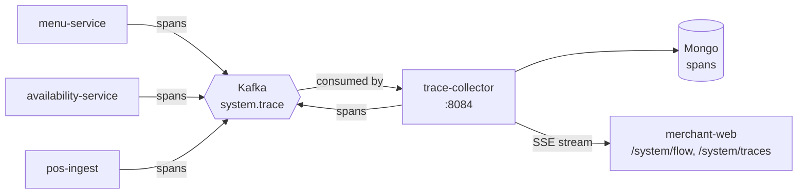

# clearpath

## The problem

A merchant's menu and a merchant's stock levels are different kinds of
data with different consistency requirements, coming from different
sources — a POS terminal polled every 30 seconds, a manual "86 this item"
tap that needs to show up in seconds, a menu edit that can take its time
propagating. Bolt them onto one service with one database and you either
slow down the fast path to protect the slow one, or silently let the slow
one drift out of sync while nobody notices.

clearpath is a small distributed system built to keep that boundary
honest: menu data is eventually consistent, availability data is near
real time, and the two are never blurred (see CLAUDE.md's non-negotiable
invariants). The interesting part isn't the CRUD — it's that a Postgres
write and a Kafka publish never diverge (transactional outbox), every
consumer is idempotent against redelivery, and every request carries a
correlation ID across HTTP, gRPC-shaped service calls, and Kafka headers
so a single merchant action can be traced end to end through every hop.
`merchant-web`'s "system x-ray" renders that telemetry directly — the
frontend doesn't simulate distributed behavior, it shows you the real
thing happening underneath.

This phase makes the system deployable and observable: real containers,
a real (if local) Kubernetes deployment, real Prometheus metrics instead
of stubs, a real load test with real numbers, and a documented safe path
for evolving a Kafka schema without breaking an old consumer.

## Architecture

Request and data flow — what owns which store, and how a menu write
reaches availability state via Kafka rather than a direct call:



Tracing flow — every service is both a producer and, in trace-collector's
case, the one consumer, of the same `system.trace` topic (see
[ADR 0003](docs/adr/0003-tracing-wire-format.md)):



`storefront-api` is the one new service this phase adds — a minimal
read-composition stub (menu-service's items joined with
availability-service's status, Redis-cached) built specifically so this
phase's Dockerfile/Kubernetes/k6 work would have a real fifth JVM service
to target instead of a placeholder. See
[`docs/adr/0007-storefront-api-stub.md`](docs/adr/0007-storefront-api-stub.md).

Every service also exposes `/health`, `/ready`, and (as of this phase) a
real Prometheus `/metrics`. See [`docs/adr/`](docs/adr/) for every other
structural decision, most importantly
[0001](docs/adr/0001-transactional-outbox.md) (the outbox pattern) and
[0003](docs/adr/0003-tracing-wire-format.md) (why tracing is a bespoke
Kafka wire format, not OpenTelemetry).

## Live flow demo


*(Not recorded yet — `merchant-web`'s `/system/flow` screen renders this
live, driven by `trace-collector`'s SSE stream; a GIF of a real merchant
action rippling through the system belongs here.)*

## Setup

### Quick path: docker-compose

```
docker compose up --build
```

Brings up Postgres, Redis, Mongo, Kafka, all seven backend
services, both mock POS providers, `merchant-web`, and Prometheus +
Grafana. Ports:

| Service | Port |
|---|---|
| menu-service | 8081 |
| availability-service | 8082 |
| pos-ingest | 8083 |
| trace-collector | 8084 |
| storefront-api | 8085 |
| merchant-web | 5173 |
| Prometheus | 9090 |
| Grafana | 3000 (admin/admin) |
| nested-pos / flat-pos mocks | 9001 / 9002 |
| Postgres / Redis / Mongo / Kafka | 5432 / 6379 / 27017 / 9092 |

Open `http://localhost:5173` for the UI, `http://localhost:3000` for
Grafana (the "clearpath overview" dashboard is provisioned automatically).

### One-command local Kubernetes (kind)

```
./deploy/k8s/kind-up.sh
```

Creates a local `kind` cluster named `clearpath`, builds all eight
application images, loads them into the cluster (`kind load
docker-image` — nothing is pulled from a registry), applies the
kustomize manifests under `deploy/k8s/base/`, and waits for every
Deployment to become ready. Then:

```
kubectl port-forward -n clearpath svc/merchant-web 5173:8080   # UI
kubectl port-forward -n clearpath svc/grafana 3000:3000        # dashboards
kubectl port-forward -n clearpath svc/prometheus 9090:9090     # raw metrics
```

Tear down with `./deploy/k8s/kind-down.sh`. See
[`deploy/k8s/`](deploy/k8s/) for the manifests — infra (Postgres/Redis/
Mongo/Kafka) runs as single-replica Deployments with `emptyDir` volumes,
a disposable local demo rather than a durability story (see Trade-offs
below).

### CI

[`.github/workflows/ci.yml`](.github/workflows/ci.yml) runs on every push
to `main` and every PR: lint (Go `gofmt`/`vet`, frontend `tsc`), unit
tests (Gradle, Go, Vitest), the Testcontainers integration suite,
`merchant-web`'s build (the OpenAPI type-generation gate — a spec/code
drift fails the build here), Playwright e2e against a live
docker-compose stack, a container build + Trivy vulnerability scan for
all eight images, and — on `main` only — a push to GHCR.

## Load test

[`load-test/storefront-api.js`](load-test/storefront-api.js) (k6) hits
storefront-api's one real endpoint, `GET /venues/{venueId}/menu`, at a
constant 50 VUs for 2 minutes against a local docker-compose stack on a
single developer laptop (not a benchmark machine, not isolated hardware —
treat these as directional, not authoritative):

```
docker run --rm --network clearpath_default \
  -v "$(pwd)/load-test:/scripts" \
  -e STOREFRONT_URL=http://storefront-api:8085 \
  -e VENUE_ID=<a real venue id from menu-service> \
  -e VUS=50 -e DURATION=2m \
  grafana/k6 run /scripts/storefront-api.js
```

**Actual results from a real run** (2,723,014 requests, 0 failures):

| Metric | Value |
|---|---|
| p50 | 1.6 ms |
| p95 | 5.15 ms |
| p99 | 9.38 ms |
| avg | 2.12 ms |
| max | 242.18 ms |
| throughput | ~22,691 req/s sustained |
| error rate | 0.00% |

These numbers are real but flattered by the cache: `storefront-api`
caches the composed response in Redis for `STOREFRONT_MENU_CACHE_TTL_SECONDS`
(default 5s), so at 50 VUs hammering one venue, the overwhelming majority
of requests are Redis hits, not the menu-service+availability-service
fan-out the cache-miss path actually costs. The `max` of 242ms is almost
certainly a cache-refill request landing during the k6 container's own
warm-up. A test that actually characterizes the composition cost would
need either a very short TTL, cache disabled, or many distinct venue IDs
to force real cache-miss traffic — none of which this run did, and the
numbers above should be read with that caveat, not as "storefront-api
handles 22k req/s of real work."

## Trade-offs and what I'd do differently at scale

- **Single-node Kafka everywhere** (docker-compose and the kind manifests
  alike) — one broker, replication factor 1. Fine for demonstrating the
  event flow, not survivable in production; a real deployment needs a
  multi-broker cluster with a real replication factor and rack awareness.
- **No durability story for infra in Kubernetes** — Postgres/Redis/Mongo/
  Kafka all run on `emptyDir`, so a pod restart loses all data. That's a
  deliberate simplification for a disposable local demo (see
  `deploy/k8s/base/postgres/deployment.yaml`'s comment), not something to
  carry into a real deployment — that needs PVCs at minimum, and probably
  managed equivalents (RDS, MSK, ElastiCache, Atlas) rather than
  self-hosted stateful pods at all.
- **DLQ depth is a cumulative counter, not a queue-depth gauge**
  (`pos_ingest_dlq_published_total`) — a true depth needs consumer-group
  lag on `pos.sync.dlq`, but nothing consumes that topic today. At scale,
  an unconsumed DLQ is itself a problem worth fixing before worrying about
  how to graph it.
- **No ingress, no TLS anywhere** — `merchant-web` is reached via
  `kubectl port-forward` or a NodePort; every service-to-service call is
  plaintext HTTP inside the cluster/compose network. A real deployment
  needs an ingress controller, cert management, and probably mTLS between
  services rather than trusting the network boundary.
- **The k6 numbers reflect a laptop, one venue, and a warm cache** — see
  the caveat above. A real capacity number needs multiple venues, a
  deliberately-varied cache hit rate, and a dedicated load-test
  environment, not a developer's machine running Docker Desktop
  alongside everything else.
- **Schema evolution only covers additive fields** (ADR 0006). Every
  consumer in this repo already deserializes with `ignoreUnknownKeys =
  true`, which makes an additive field trivially safe but says nothing
  about field removal or type changes — those need a real multi-version
  migration strategy this repo doesn't have yet.
- **Kafka consumer lag is polled on-demand via AdminClient**, not scraped
  continuously by something like `kafka-lag-exporter` — fine at this
  request volume (a dashboard refresh, not production monitoring
  traffic), not fine at real scale where lag needs to be an alertable,
  continuously-collected series.
- **`MONITORED_CONSUMER_GROUPS` and the Prometheus scrape config are both
  static, hand-maintained lists** — a new consumer group or a new
  service's `/metrics` endpoint needs adding by hand in two places. A
  real deployment wants service discovery (Kubernetes `ServiceMonitor`
  CRDs via the Prometheus Operator, for instance) instead.
- **No Kotlin lint gate** — CI's `lint` stage covers Go (`gofmt`/`vet`)
  and the frontend (`tsc`), but there's no ktlint/detekt wired in for the
  four JVM services; their only static check today is compilation.
  Deliberately not added in this phase — bolting on a formatter and
  reformatting the whole codebase unreviewed at the tail end of an
  already large change felt like the wrong tradeoff, but it's a real gap.
- **Redis `KEYS`-based venue listing** in availability-service (noted in
  ADR 0002) should become a maintained set or `SCAN` before production
  traffic — `KEYS` blocks Redis for the duration of the scan.
